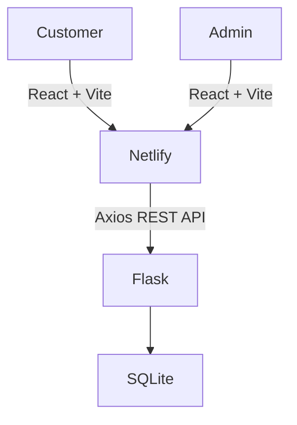

# Gloss & Glow Studio — Booking & Management Platform

A full-stack booking and business management platform built for **Gloss & Glow**, a premium car detailing studio in Science City, Ahmedabad.

The platform allows customers to browse detailing services, book appointments online, and enables administrators to efficiently manage appointments and services through a secure dashboard.

## Live Demo

**Frontend:** https://gloss-and-glow-studio.netlify.app/

**Backend API:** https://gloss-glow-backend-h2xo.onrender.com/

---

# Screenshots

## Home Page


---

## Booking Page


---

## Admin Dashboard


---

## Appointment Management


---

# Tech Stack

| Layer | Technology |
|--------|------------|
| Frontend | React 19, Vite, Tailwind CSS, React Router, Axios |
| Backend | Python, Flask, Flask-Session, Flask-CORS, Gunicorn |
| Database | SQLite |
| Authentication | Session-based Authentication (Flask-Session + Werkzeug Password Hashing) |
| Deployment | Netlify (Frontend), Render (Backend) |

The project follows a client-server architecture where the React frontend communicates with a Flask REST API, which manages business logic and persists data in SQLite.
---

# Features

## Customer Features

- Modern responsive landing page
- Browse available detailing services
- Dynamic gallery
- Online appointment booking
- Dynamic service selection
- Dynamic time slot selection
- Slot-capacity validation to prevent overbooking
- Contact information page

---

## Admin Features

- Secure session-based login
- Dashboard with booking statistics
- Appointment management
  - View appointments
  - Update appointment status
  - Delete appointments
- Service management
  - Add services
  - Edit services
  - Activate/Deactivate services
- Protected admin routes using authentication middleware

---

# System Architecture



---

# Project Structure

```text
gloss-glow-booking-platform/
│
├── backend/
│   ├── app/
│   │   ├── __init__.py
│   │   ├── routes.py
│   │   └── database.py
│   │
│   ├── run.py
│   ├── requirements.txt
│   └── .env
│
├── frontend/
│   ├── src/
│   │   ├── api/
│   │   ├── components/
│   │   ├── context/
│   │   ├── pages/
│   │   └── assets/
│   │
│   ├── public/
│   │   └── _redirects
│   │
│   ├── package.json
│   └── vite.config.js
│
├── docs/
│
└── README.md
```

---

# Local Development

## Prerequisites

- Python 3.10+
- Node.js 18+

---

## Backend

```bash
cd backend

python -m venv venv

# Windows
venv\Scripts\activate

# Linux / macOS
source venv/bin/activate

pip install -r requirements.txt

python app/database.py

python run.py
```

Backend runs on:

```
http://localhost:5000
```

---

## Frontend

```bash
cd frontend

npm install

npm run dev
```

Frontend runs on:

```
http://localhost:5173
```

---

# Environment Variables

Create:

```
backend/.env
```

```env
SECRET_KEY=your-secret-key
FLASK_ENV=development
FRONTEND_URL=http://localhost:5173
```

---

# REST API

## Public Routes

| Method | Endpoint | Description |
|--------|----------|-------------|
| GET | `/api/services` | Get active services |
| GET | `/api/gallery` | Get gallery images |
| GET | `/api/slots` | Get available booking slots |
| POST | `/api/appointments` | Create appointment |

---

## Authentication

| Method | Endpoint | Description |
|--------|----------|-------------|
| POST | `/api/auth/login` | Admin login |
| POST | `/api/auth/logout` | Admin logout |

---

## Admin Routes

| Method | Endpoint | Description |
|--------|----------|-------------|
| GET | `/api/admin/dashboard` | Dashboard statistics |
| GET | `/api/admin/appointments` | Get all appointments |
| PUT | `/api/admin/appointments/<id>` | Update appointment |
| DELETE | `/api/admin/appointments/<id>` | Delete appointment |
| GET / POST | `/api/admin/services` | List / Create services |
| PUT / DELETE | `/api/admin/services/<id>` | Update / Delete service |

---

# Database

SQLite database containing **5 tables**.

| Table | Purpose |
|--------|----------|
| `appointments` | Customer bookings |
| `services` | Service catalog |
| `slot_settings` | Booking slots & capacity |
| `gallery_images` | Gallery records |
| `admins` | Administrator accounts |

---

# Security

Current implementation includes:

- Session-based authentication
- Password hashing using Werkzeug
- Protected admin endpoints
- CORS configuration
- Environment variables for secrets
- Backend validation for booking requests

---

# Future Improvements

Potential production enhancements:

- PostgreSQL migration
- Rate limiting using Flask-Limiter
- Email notifications
- Twilio SMS reminders
- Cloud image uploads (Cloudinary / AWS S3)
- Revenue analytics dashboard
- CSRF token protection
- Docker deployment

---

# Internship Context

Developed as a **Summer Internship Project** for **Gloss & Glow Auto Detailing Studio**, Science City, Ahmedabad, during the MSc IT programme at DAIICT.

The project was developed as a digital booking and management solution for a local car detailing studio, demonstrating how an appointment-based workflow can be streamlined through a web application.
---

# License

Developed for **academic and internship purposes**.

Not intended for commercial redistribution.

---

## Developer

**Bansari Akhani**

M.Sc. Information Technology

DAIICT
